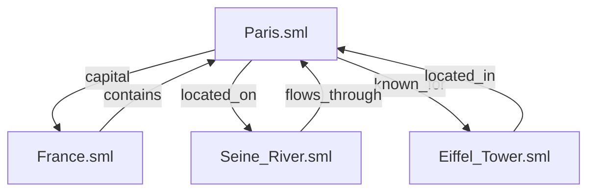

# SigilML Complete System Navigation

## Overview

SigilML (Sigil or sigil) system navigation schema converts static document (SML formatted .sml files) collections into traversable knowledge paths. The system facilitates algorithms traversing a citation network whilst aggregating relevant context and bypassing or discarding irrelevant sections, similar to a human researching through a wiki style dataset. This provides a versatile optimized analytic capabilities to feasibly integrated algorithms, which human readable wiki articles can easily be derived from to allow humans and the algorithm to use identical data as a reliable source of factual information

## Structure

Sigil consists of two distinct components, the Sigil.py interpreter and the SML schema.

The SML schema consists of SML formatted .sml files or formatted responses. The format includes a standardized citation tag which allows files to point to other files or parts of files. The citation consists of an HTML link and flags to specify a location in the article. During use, the Sigil.py interpreter will automatically (or explicately by the user) create a knoledge graph of the files included in a single volume, noting edges. During use, the knoledge graph will be incremented with heatmap data to indicate which nodes are often accessed by (any) algorithms. If PageRank is integrated in the system, that can also be used to weight pages in a user agnostic metric. When Sigil accesses files, it expands the link by replacing it in memory with the cited text, and that text is available in context, file, or a new cell or window depending on how the data is used. If the citation is another .sml file, it will very likely contain multiple other citations which can then be opened. This creates a wiki style navigation method entirely in memory, which an algorithm can utilize to effeciently derive information that it does not know to explicitly search for. It also can be used to create a human readable wiki format from the same data structure, resulting in a wiki archive which is efficiently read by both humans and algorithms ensuring that they have the same information

Sigil.py is a minimal weight C based interpreter as a python package designed to transform the SML data, follow citations, and use circuit breaker logic to prevent typical redirect loops and other common forms of linkception. The package provides a set of functions which can analyze an SML file and decide what to do with citations. Argument 1 allows the algorithm to accept the specified citation passage, pull the entire cited file, collapse it to a hyperlink (for human readable articles), or strip citations to serve plaintext. Argument 2 specifies the format that the function returns. XML output is directly translatable from SML but citations are lost. Rich text preserves citations in the format specified in the first argument. Plain text is a simple output with all annotations removed, suitable generic output. Argument 3 specifies the type of data being ingested, either native SML, JSON. XML typically has limited functionality due to the lack of html, but once converted the data can be easily enriched by an ai model by adding links. SML and JSON as input can both have full functionality, with JSON potentially having the same citation data in a particular format attached to objects. This is significant because it allows Sigil to accept input from API sources which includes MCP, SQL, and theoretically also system data for automated system development if Sigil were to be built upon at a low level.

If the algorithm opens a nestled or chained navigation, it would likely need to take multiple steps and expand different branches during navigation to extract all relevant information during a search. To streamline the process, it is possible to allow the interpreter to produce a 'thread' or route in the python environment which plots the algorithm has previously taken. The next time the algorithm would search the SML library it first checks what related threads exist. It might use a part of a thread or an entire threat to ingest multiple files in one operation, or it might transform the thread from one relationship to another (`france.sml`⊃`paris.sml` becomes `italy.sml`⊃`rome.sml`) and if the relationship exists as edges in the knowledge graph at each step, the algorithm knows that the transformed thread is valid and it can use the thread. The threads themselves can be visualized as a flowchart where roots are consolidated, where specific branch points are assigned a time decaying value representing how often that citation is used. Threads below a threshold are pruned, and frequently accessed threads may be immortalized to prevent them from being weighted lower in the future (even if it is never prunes, the algorithm is less inclined to follow it if the weight decays with time. if the thread is consistently accessed, it may be more efficient to just load it most of the time anyway and since the algorithm can see the name of the file it can also decide to just not load it even with a high weight).

In summary, SML is an XML/LaTeX format with a specific citation format. Files can lead to other files indefinately and the interpreter has circuit breakers baked in. Sigil.py can convert JSON to SML/XML but the process is not reversable. Sigil.py can output SML, rich text, or XML but XML will lack the rich data.

## Core Architecture

### 1. Citation Network Foundation

The system is built upon an archival paradigm comparable to archives:

- **Documents are nodes**: Each .sml file represents a knowledge unit
- **Citations are edges**: Bidirectional links with semantic relationships
- **Context is aggregated**: Citations include contextual anchoring information
- **Network is maintained**: Active curation ensures relevance and accuracy



### 2. Algorithmic Navigation Engine

The interpreter provides sophisticated traversal capabilities:

- **Entry Point Flexibility**: Start navigation from any document
- **Recursive Traversal**: Follow citations indefinitely (Wikipedia-style)
- **Duplicate Prevention**: Track visited documents to avoid cycles
- **Depth Control**: Configurable traversal depth and breadth
- **Context Preservation**: Maintain contextual thread during navigation

## Navigation Modes

### 1. Discard Mode (Text-Only Navigation)

```
Input: "Paris is the capital of [France]. It's located on the [Seine River]."
Output: "Paris is the capital of France. It's located on the Seine River."
```

- Removes all citation markers
- Preserves hyperlink text
- Returns clean, non-rich text
- Ideal for simple information extraction

### 2. Passage Mode (Contextual Expansion)

```
Input: "Paris is known for its [Eiffel Tower] landmark."
Output: "Paris is known for its Eiffel Tower landmark. The Eiffel Tower, completed in 1889 as the entrance arch for the 1889 World's Fair, stands at 330 meters tall and is one of the most recognizable structures in the world."
```

- Expands citations to relevant passages
- Maintains contextual flow
- Preserves document structure
- Supports paragraph-level or object-level expansion

### 3. Default Mode (Complete Document)

```
Input: "For more information, see [French_Cuisine]."
Output: [Complete content of French_Cuisine.sml including all its citations]
```

- Returns entire referenced document
- Preserves all nested citations
- Maintains original structure
- Enables further recursive traversal

## Advanced Navigation Features

### 1. Pathway Tracking System

```json
{
  "pathway_id": "nav_20240123_001",
  "start_point": "Paris.sml",
  "navigation_steps": [
    {
      "document": "Paris.sml",
      "entry_time": "2024-01-23T10:00:00Z",
      "exit_time": "2024-01-23T10:00:05Z",
      "expansion_mode": "default",
      "relevance_score": 0.95
    },
    {
      "document": "France.sml",
      "entry_time": "2024-01-23T10:00:06Z",
      "exit_time": "2024-01-23T10:00:12Z",
      "expansion_mode": "passage",
      "relevance_score": 0.88,
      "expanded_sections": ["history", "geography"]
    }
  ],
  "total_duration": "12s",
  "average_relevance": 0.91
}
```

### 2. Time Decay Heatmap Generation
Each citation in an .sml file will have a heatmap entry created the first time Sigil access the citation. Citations which are never used are not represented and entries which fall below a threshold are pruned. Each entry is an \item with two values. the first is correlation, the percentage of time that any algorithm on a given page goes on to access the given citation, and the second is usage trends. A 0.5 

\begin{heatmap}
    \item \textbf{Related concepts:}
    \begin{edges}
        \item Eiffel Tower: $(0.95, 0.5)$
        \item French Revolution: $(0.72)$
        \item Louvre Museum: $(0.88, 0.)$
    \end{edges}
\end{headmap}

### 3. PageRank Integration

```
PageRank Scores (example):
- Paris.sml: 0.85 (high centrality)
- France.sml: 0.92 (hub document)
- Eiffel_Tower.sml: 0.78 (specialized but popular)
- French_Cuisine.sml: 0.65 (niche topic)
```

## Complete Use Case: Paris Information Navigation

### Scenario: Researching Paris for Travel Guide

**Starting Point**: `Paris.sml`

**Navigation Path**:

1. **Initial Query**: User: "Tell me about Paris"
   - Interpreter loads `Paris.sml` in default mode
   - Returns complete document with all citations intact
   - Tracks pathway start point

2. **First Expansion**: Model: "I will navigate relevant citations in Paris.sml"
   - Incorporates PageRank data to prioritize relevant sections, sees that `France.sml` is commonly associated
   - Navigates to `France.sml`
   - Model sees that `French_Food.sml` is highly associated with France, but not enough to follow an irrelevant citation as a secondary navigation 
   - Model opens `French_Revolution.sml` because the user context indicated an interest in history
   - Creates a navigation pathway containing `Paris.sml > France.sml > French_Revolution.sml`

3. **Contextual Discovery**: User: "What about French culture?"
   - Algorithm detects relevant citations in current context
   - Follows "French culture" link to `French_Culture.sml`
   - Expands "Parisian culture" section specifically
   - Increments heatmap data for `French_Culture.sml`

4. **Deep Dive**: User: "Tell me about the Eiffel Tower"
   - Navigates to `Eiffel_Tower.sml`
   - Sees in PageRank data that `Paris.sml` is commonly associated, but the intepreter detects that this is already in context so the citation does not expand
   - Detects and follows related citations because the model decides that the related concepts are relevant to the User inquiry:
     - `Gustave_Eiffel.sml` (architect)
     - `1889_World_Fair.sml` (historical context)
     - `Iron_Construction.sml` (engineering aspects)

5. **Pathway Reuse**: Model: "There might also be context related to the Eiffel Tower outside of Paris. I will open the pathway from before and see if there is anything else to expand"
   - Retrieves stored pathway `Paris.sml > France.sml > French_Revolution.sml`
   - Replays navigation in single step
   - Returns consolidated cultural information
   - Updates heatmap with new access data
   - The model gains the context related to the French Revolution which it would have otherwise missed

6. **Syllogistic Navigation**: User: "What about Italian culture?"
   - Model realizes that `Paris.sml > France.sml > French_Culture` likely corresponds to `Rome.sml > Italy.sml > Italian_Culture.sml` which is a valid pathway according to the PageRank data
   - The user is asking about Italian culture and the concepts do intersect, so it expands that pathway
   - Last time the user asked about the Eiffel Tower, but there isn't really a historical equivalent in Italy unless you look at ancient times. The `Roman_Colosseum.sml` file is not expanded, but the model still knows of the existance of the Roman Colosseum based on the hyperlink text and prior training.
   - Creates a navigation pathway containing `Rome.sml > Italy.sml > Italian_Culture.sml`
   - Notices that `French_Food.sml` and `Italian_Food.sml` were both highly ranked with PageRank and Heatmap, so maybe there is a connection there?
   - Opens `French_Food.sml` and `Italian_Food.sml`. There are some references but no concrete links, but there is still good context that was missed previously
   - Update heatmap data because the two files were opened, but not PageRank data because a link was not used
   - The model discusses Italian food which would have been missed previously, and mentions that both cultures are known for their food

7. **Cumulative Navigation**: User in a later session: "What is the significance of food culture in Spain"
   - This is a new session, so there is no context from before but the model still sees the heat map and pathways Sigil created previously
   - "It seems slightly vague--Spain is a country in Europe, is there a larger trend within that category the user is referring to?"
   - "Italy and France has a high correlation between food and culture. There are already sigil pathways for both of those which mention 'culture' starting from their capitals, so the capital of Spain (Madrid) seems like a good place to start. This is a valid pathway going by PageRank data."
   - The model synthesizes `Madrid.sml > Spain.sml > Spanish_Culture.sml` and adds that to context in one step.
   - "There is also a notable pattern in the heat map for concepts related to historical context in France and Italy, so maybe it is also worth looking at the historical context here rather than just cultural." 
   - The model expands citations related to history looking for anything that could mention food
   - "It seems like Spain was occupied by Rome. The list of countries occupied by Rome includes modern France and Italy, technically. Several other regions Rome once occupied area also known for their food compared to regions they did not occupy. This may be worth researching"
   - Model navigates to `Ancient_Roman_Food.sml` to compare with modern food .sml files
   - "There doesn't seem to be much direct connection between Ancient Roman food and modern Spanish food. However the trade network spanning the Roman Empire outlasted the Empire itself, and you can clearly see the correlation between food and what the trade routes would have been."
   - Discards the `Ancient_Roman_Food.sml` and other files related to Rome from context and opens `Late_Ancient_Roman_Trade.sml` and `Europe_Trade_Routes.sml`, and also `Morroco.sml` and `Colonial_America.sml` which represent the largest trade partners in recent times
   - "There seems to be a general correlation between trade routes and food, especially in Spain. The user's question makes more sense now."
   - The model discusses the impact of trade and the economy on both food and culture in Spain and its evolution from historical times, but that the increase in oceanic trade routes over time led to more diversification of Spanish food. Through the extensive trade with Morocco and the Americas, Spanish food and culture both evolved over time with significant infuence from those cultures.

0. **Discussion**:
   This is assuming that a thinking model with little to no knowledge of the topic is used, which is unrealistic, but demonstrates how Sigil aims to be used by a thinking model when given a data retreival task. Without SML traversal, the model might have been trapped in a thinking loop in which it is trying to think of as many details from its training data as possible. It might take a long time to respond and becomes more likely to generate maladaptive tokens the longer internal reasoning continues cyclically. With SML traversal the thinking portion of the model is given something to do, which is work through the files while following links that seem relevant and then break when confident in a response. By giving the model a reasoning application for non reasoning prompts, the model can determine for itself whether it has the information required for a response. 
   
   In practical usage simple retrieval prompts which is typically ineffecient for thinking models becomes 
   | prompt 
   |> scan one or more sml files which relate to the current task
   |> expand links only if relevant, more likely to open links with a high PageRank
   |> briefly restate primitive truths from that context and training data
   |> end thinking and generate final output

   This process would take only the tokens required. If the first .sml contains no relevant information yet the model has confidence in its response, it simply states the answer inside the thinking block and then immediately generates the response. 


### Result: Comprehensive Knowledge Structure

```json
{
  "query": "Paris travel information",
  "navigation_summary": {
    "documents_visited": 8,
    "total_time": "45s",
    "pathways_created": 3,
    "unique_concepts_discovered": 15
  },
  "knowledge_structure": {
    "core": {
      "Paris": {
        "capital_of": "France",
        "located_on": "Seine River",
        "known_for": ["Eiffel Tower", "Louvre Museum", "Notre Dame"]
      }
    },
    "context": {
      "France": {
        "government": "Republic",
        "language": "French",
        "population": "67 million"
      },
      "Eiffel Tower": {
        "height": "330m",
        "completed": "1889",
        "architect": "Gustave Eiffel"
      }
    },
    "cultural": {
      "French Cuisine": ["baguette", "croissant", "wine"],
      "Art Movements": ["Impressionism", "Cubism"],
      "Literature": ["Victor Hugo", "Albert Camus"]
    }
  },
  "relevance_heatmap": {
    "high": ["Eiffel Tower", "French Cuisine", "Louvre"],
    "medium": ["Seine River", "Notre Dame", "Montmartre"],
    "low": ["Paris Metro History", "19th Century Urban Planning"]
  },
  "navigation_pathways": [
    {
      "id": "cultural_path",
      "steps": ["Paris.sml", "French_Culture.sml", "French_Cuisine.sml"],
      "relevance": 0.92
    },
    {
      "id": "historical_path",
      "steps": ["Paris.sml", "France.sml", "French_Revolution.sml"],
      "relevance": 0.85
    }
  ]
}
```

## Technical Implementation

### Interpreter Workflow

```
1. Receive navigation request with parameters
2. Transform data to SML if required
3. Load starting SML data or files
4. Parse citation network structure
5. Apply expansion mode settings
6. Invoke circuit breaker logic
7. Transform data as return return
8. Loop to step 2 if specified
9. Update thread and increment heatmap
```

## Future Enhancements

### 1. Machine Learning Integration
- Predictive citation expansion
- Automated relevance tuning
- Personalized navigation pathways
- Conceptual similarity detection

### 2. Real-time Collaboration
- Multi-user pathway sharing
- Concurrent navigation sessions
- Collaborative knowledge mapping
- Real-time relevance feedback

### 3. Advanced Visualization
- Interactive knowledge graphs
- 3D citation network visualization
- Temporal heatmap animations
- Conceptual clustering views

## Conclusion

SigilML's complete system navigation transforms static document collections into living knowledge ecosystems. By enabling algorithmic traversal through citation networks with advanced pathway tracking, relevance scoring, and heatmap generation, the system provides unprecedented capabilities for information discovery, contextual understanding, and knowledge management. The Paris travel guide example demonstrates how seemingly simple queries can evolve into comprehensive knowledge structures through intelligent, adaptive navigation.
