# SigilML Process Flow Diagram

## High-Level System Flow

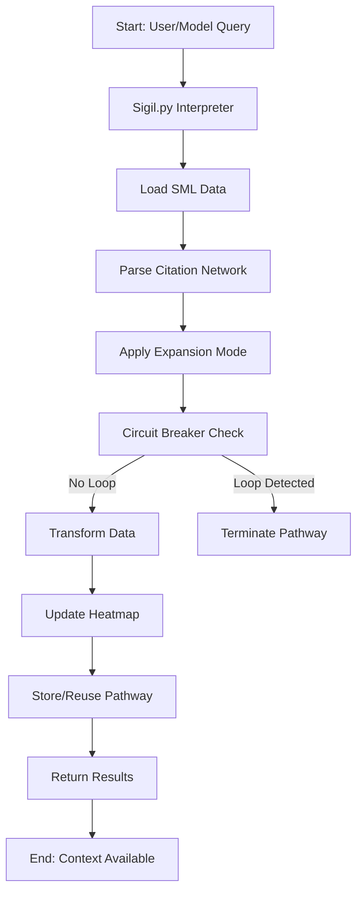

## Detailed Process Flow

### 1. Initialization Phase

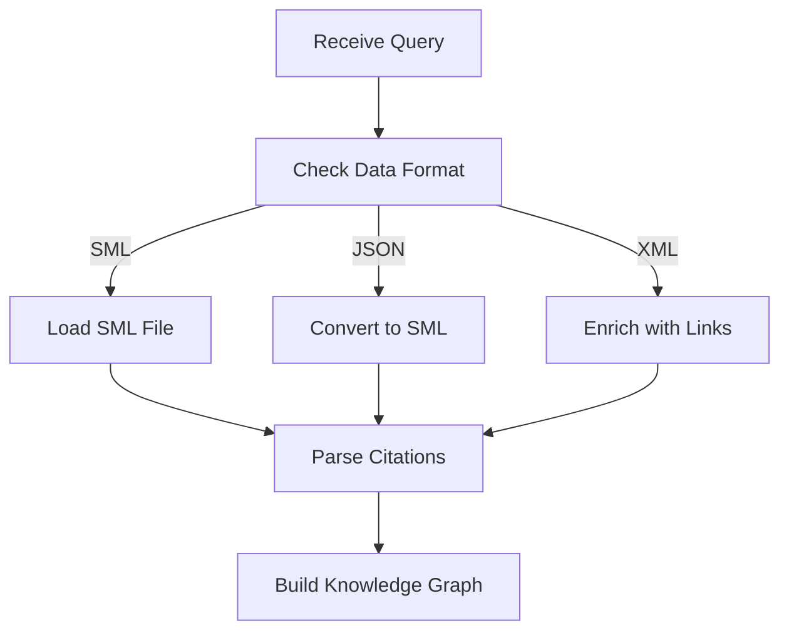

### 2. Navigation Phase

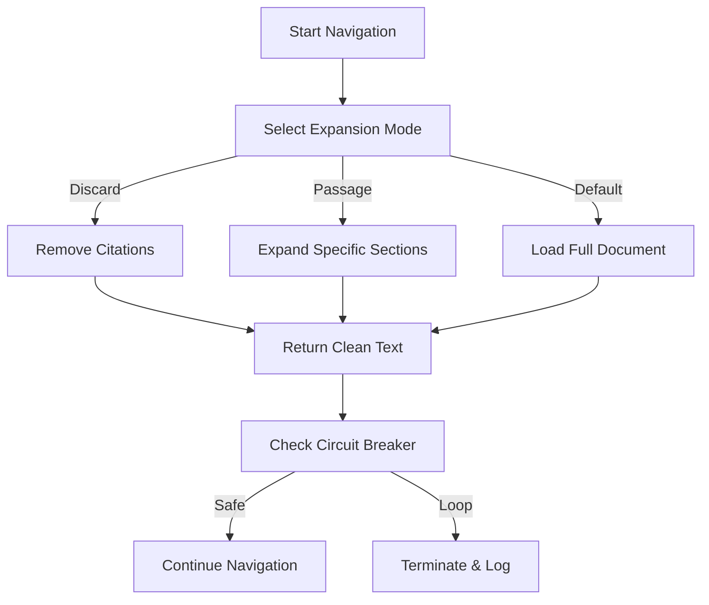

### 3. Pathway Management

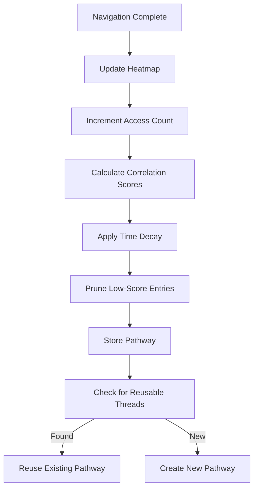

### 4. Model Interaction Flow

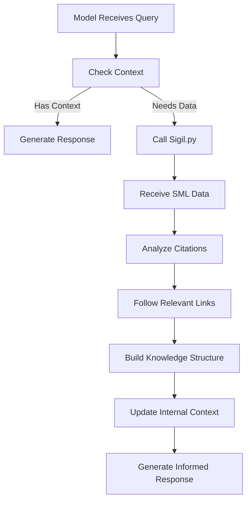

### 5. Complete Paris Example Flow

```mermaid
graph TD
    A5[User: "Tell me about Paris"] --> B5[Sigil: Load Paris.sml]
    B5 --> C5[Model: Analyze Citations]
    C5 -->|France.sml| D5[Sigil: Load France.sml]
    C5 -->|Eiffel Tower.sml| E5[Sigil: Load Eiffel Tower.sml]
    D5 --> F5[Model: Detect French Revolution relevance]
    F5 --> G5[Sigil: Load French Revolution.sml]
    E5 --> H5[Model: Follow architect citation]
    H5 --> I5[Sigil: Load Gustave Eiffel.sml]
    G5 --> J5[Model: Create Cultural Pathway]
    I5 --> J5
    J5 --> K5[Sigil: Update Heatmap]
    K5 --> L5[Model: Generate Comprehensive Response]
```

### 6. Thread Transformation Example

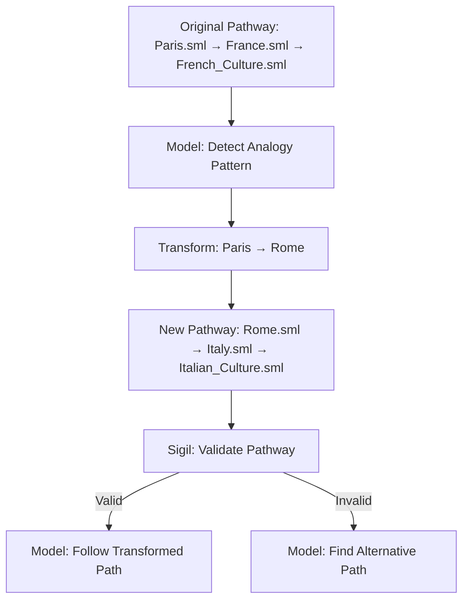

### 7. Heatmap Data Flow

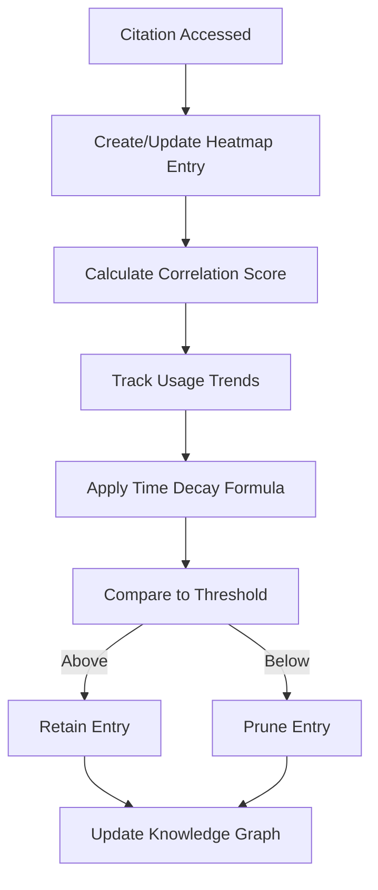

### 8. Circuit Breaker Logic

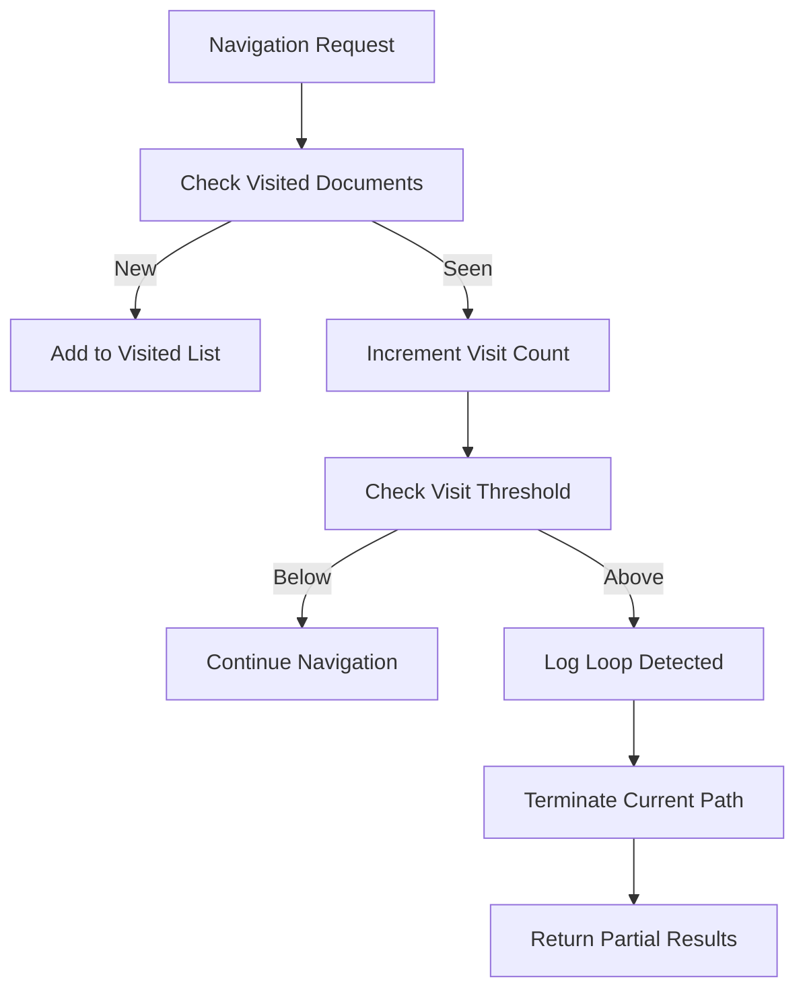

## Sequence Diagrams

### Model-Sigil Interaction

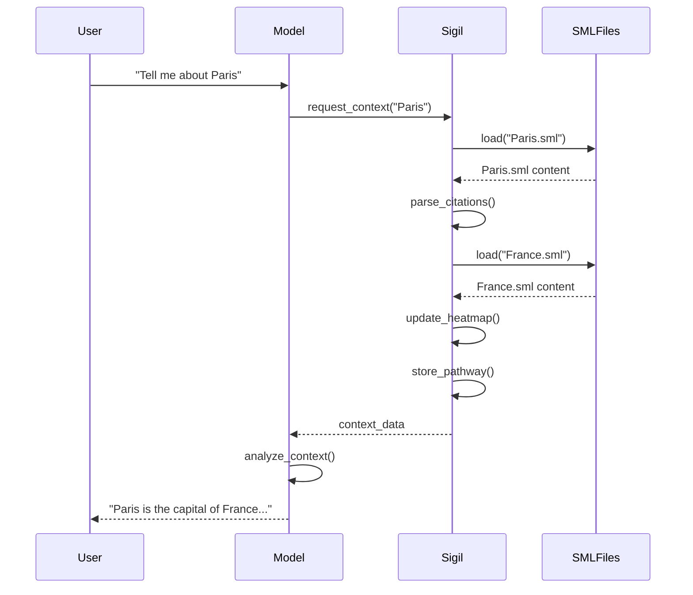

### Pathway Reuse Sequence

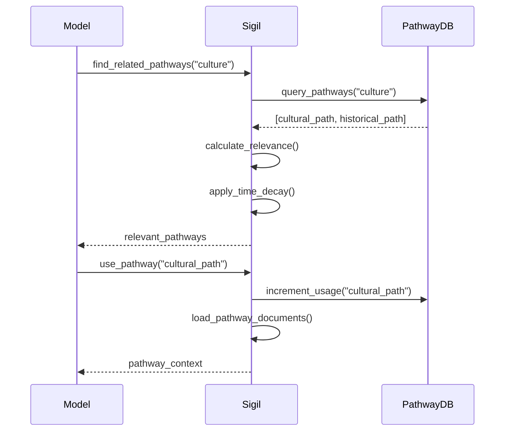

## State Transition Diagrams

### Document Processing States

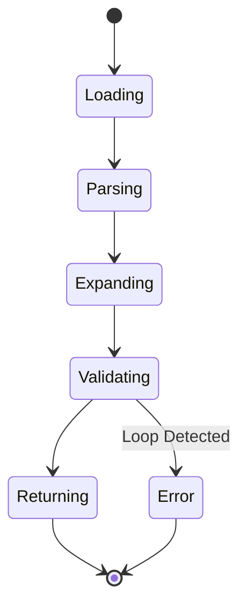

### Pathway Lifecycle

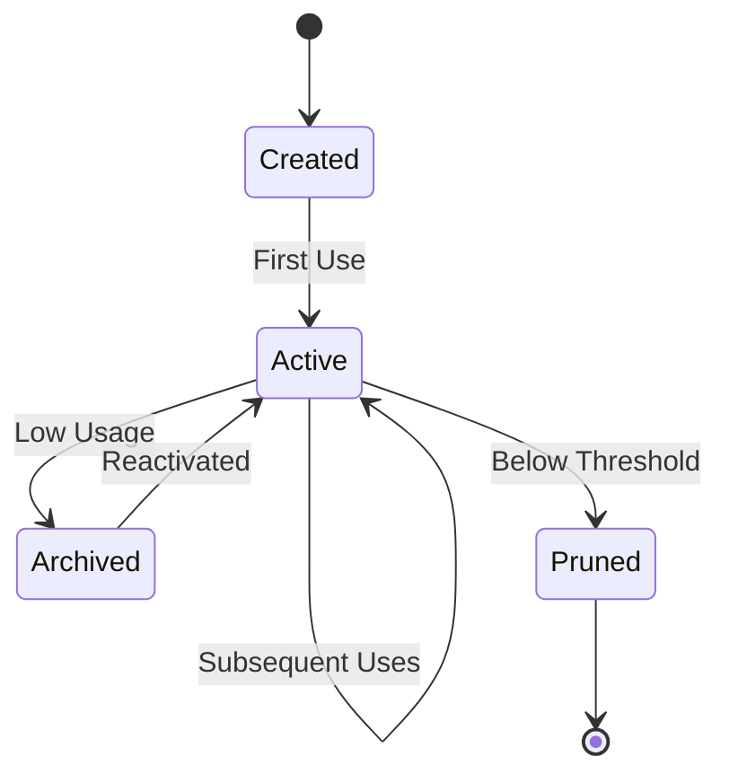

## Data Flow Diagrams

### Main Processing Pipeline

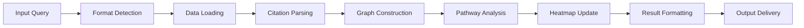

### Heatmap Data Processing

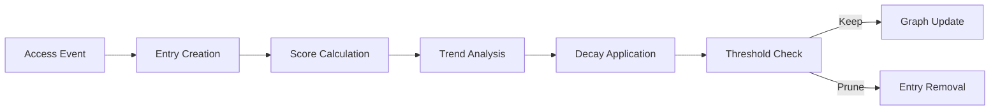

## Key Process Characteristics

### 1. Circuit Breaker Patterns
- **Visit Threshold**: Maximum 3 visits to same document per pathway
- **Depth Limit**: Configurable maximum traversal depth
- **Time Limit**: Maximum processing time per query
- **Memory Limit**: Maximum documents in memory simultaneously

### 2. Heatmap Parameters
- **Correlation**: 0.0-1.0 scale of citation usage probability
- **Usage Trend**: -1.0 to 1.0 scale of increasing/decreasing usage
- **Time Decay**: Exponential decay based on last access time
- **Prune Threshold**: Correlation < 0.3 and no usage in 30 days

### 3. Pathway Metrics
- **Relevance Score**: Weighted average of document relevance
- **Usage Frequency**: Total pathway accesses
- **Recent Usage**: Time since last access
- **Branch Points**: Number of decision points in pathway

## Performance Optimization Patterns

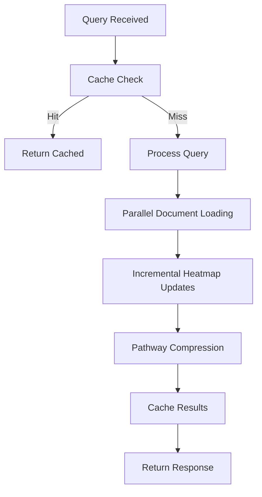

## Error Handling Flow

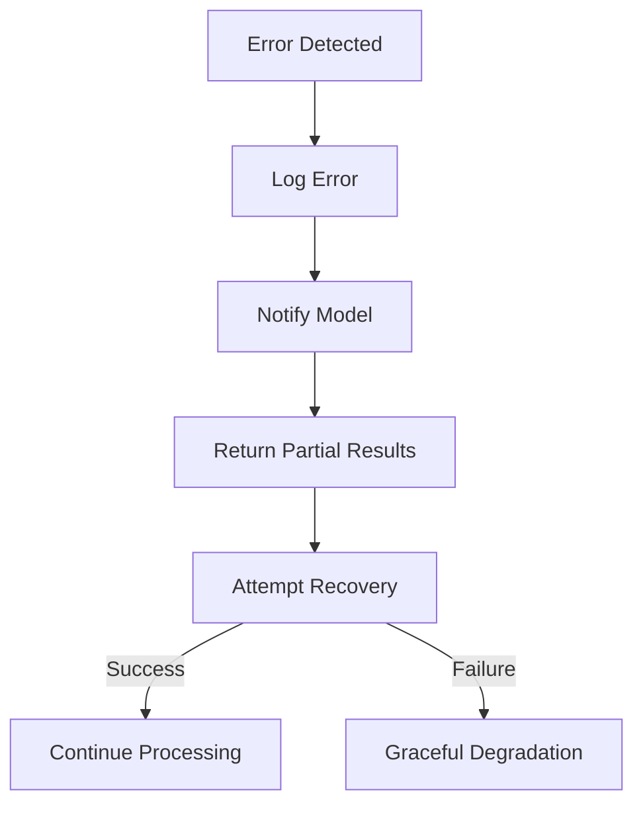

## Conclusion

These flow diagrams illustrate the complete SigilML process architecture, from initial query handling through complex navigation patterns to final result delivery. The system's design emphasizes efficient knowledge traversal, intelligent pathway management, and robust error handling to create a reliable foundation for algorithmic information discovery.
